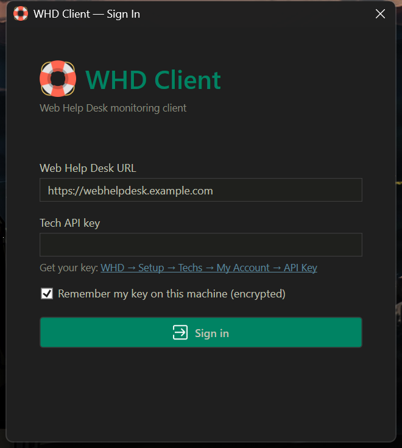
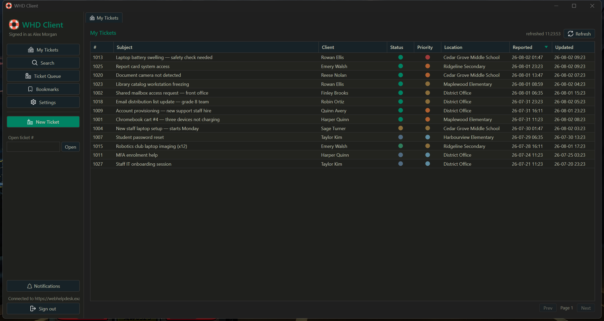
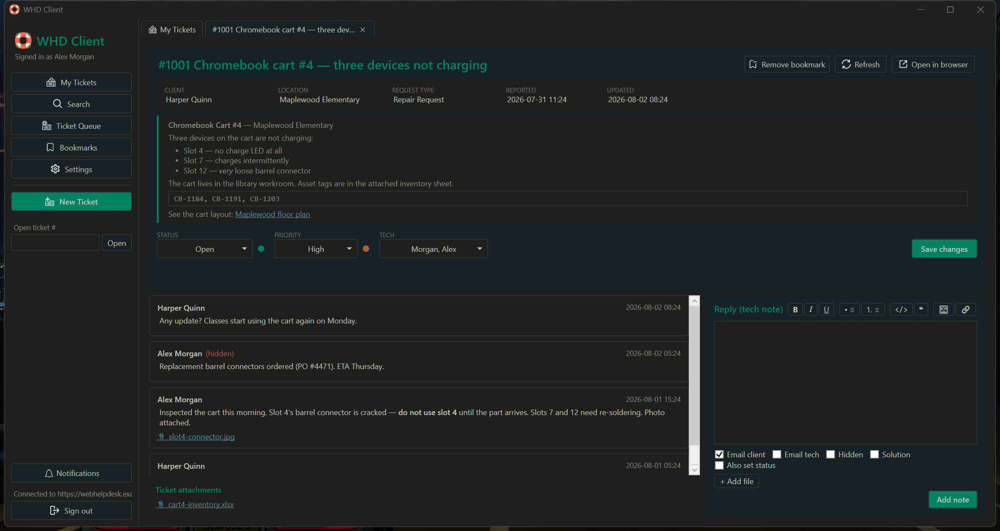
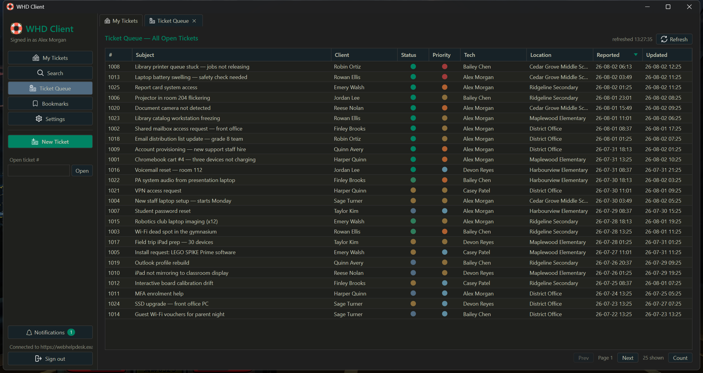
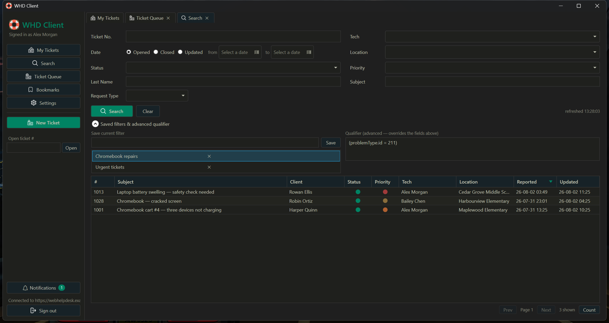
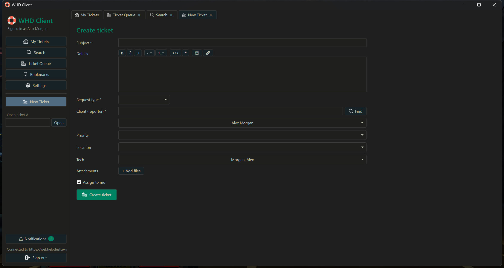
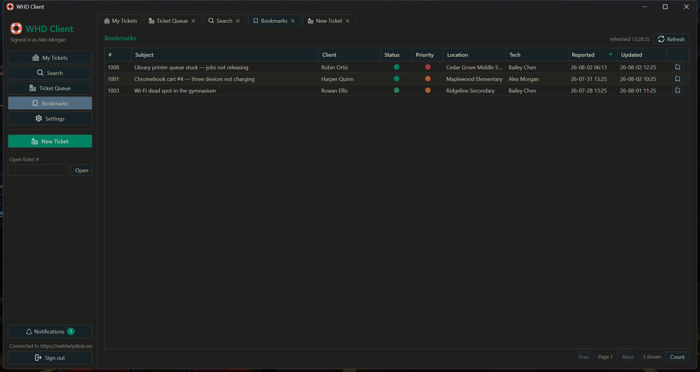
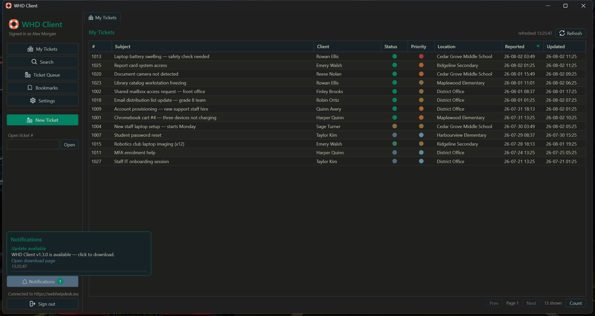
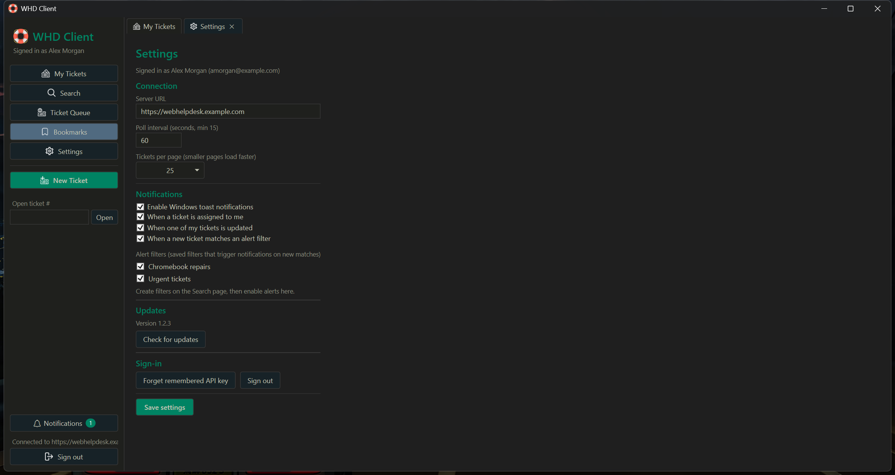

# WHD Client

A Windows desktop client for [SolarWinds Web Help Desk](https://www.solarwinds.com/web-help-desk) (WHD) ticketing system (tested with WHD 2026.1), built with C# and WPF on .NET 10.

Designed to monitor incoming and assigned tickets, alert you when things change, and allows you work on tickets without touching the web UI.

**[Download the latest MSI installer here!](https://github.com/eigengrau-/WHDClient/releases/latest)**

## Screenshots

<details>
<summary>Expand to view</summary>

Taken in demo mode (`WHD_DEMO=1`): every name, location, and ticket is fabricated.

**Sign in**: server URL + tech API key (masked, optionally remembered encrypted)

[](docs/screenshots/login.png)

**My Tickets**: tickets assigned to you, auto-refreshed, with colour-coded status/priority dots and column sorting



**Ticket detail**: BBCode-rendered request details, notes thread (newest first), attachments, reply editor with BBCode toolbar, bookmark and open-in-browser buttons



**Ticket Queue**: every open ticket across all tech groups, with pagination



**Search**: field filters, cascading request type, raw advanced qualifier, and savable named filters



**New Ticket**: cascading request types, client lookup, tech assignment, BBCode editor, attachments



**Bookmarks**: quick access to tickets you follow, with one-click removal



**Notifications**: in-app feed plus Windows toasts for assignments, updates, filter matches, and app updates



**Settings**: connection, polling, page size, notification alerts, and update checking



</details>

## Features

- **Ticket tabs**: Open multiple tickets side by side; reply with notes, change status/priority, add attachments, open in browser
- **Notifications**: Windows toast notifications when a ticket is assigned to you, one of your tickets is updated, or a new ticket matches an alert filter
- **Search/Alert Filters**: Create and save a search and then enable notifications for the filter in the settings page to receive notifications
- **Auto-refresh**: Ticket information is automatically refreshed on a configurable poll interval
- **Dark theme**: No more burnt retinas!

## Pages

- **My Tickets**: Tickets assigned to you
- **Ticket Queue**: All open tickets across every tech group, with pagination
- **Search**: Full ticket search plus a raw advanced-qualifier box; searches can be saved as named filters
- **New Ticket**: Create tickets with cascading request-type selection, client lookup, priority/location/tech assignment, BBCode editor, and file attachments
- **Bookmarks**: Pin tickets you keep coming back to

## Installation/Updates

Download the latest MSI from the [releases page](https://github.com/eigengrau-/WHDClient/releases/latest) and run it.

The installer upgrades existing installations in place, so you do not need to uninstall the old version first. Your settings, saved filters, and bookmarks are preserved.

## Getting a WHD API key

In the WHD web UI, sign in as a tech and open your account setup page:

```
https://<your-whd-server>/helpdesk/WebObjects/Helpdesk.woa/wa/Nav?path=setup-techs-myaccount
```

Generate/copy the API key there, then paste it into the WHD Client sign-in window along with your WHD server URL.

### API key security

WHD tech API keys grant full API access as that tech. Treat them like a password.

- **At rest:** if you choose "remember me" at sign-in, the key is encrypted with Windows DPAPI (`ProtectedData`, `CurrentUser` scope) before being written to `%APPDATA%\WHDClient\settings.json`. It can only be decrypted by the same Windows user account on the same machine. The plaintext key is never written to disk.
- **In transit:** the key is sent only to the WHD server URL you configured, over HTTPS, as the `apiKey` parameter on WHD REST API requests. It is never sent anywhere else and never written to logs.


## Build from source

### Requirements

- Windows 10 (17763) or later
- [.NET 10 Desktop Runtime](https://dotnet.microsoft.com/download/dotnet/10.0) (only if running without the installer; the MSI bundles what it needs)
- A Web Help Desk instance (tested against WHD 2026.1) and a **tech API key**


### Requires the .NET 10 SDK.

```powershell
dotnet build WHDClient.sln
dotnet test WHDClient.sln          # core unit tests
dotnet run --project src/WHDClient # launch the app
```
### Demo mode

To try the app without a WHD server (or take screenshots without real data), set `WHD_DEMO=1`; the app then serves fabricated tickets, people, and lookups locally. Any server URL and API key are accepted, and nothing is read from or written to a real server or your real settings:

```powershell
$env:WHD_DEMO = 1
dotnet run --project src/WHDClient
```

### Installer (MSI)

Requires [WiX Toolset](https://wixtoolset.org/) (`wix` .NET tool). Builds a self-contained x64 MSI:

```powershell
powershell -ExecutionPolicy Bypass -File installer/build-installer.ps1
# output: installer/bin/Release/WHDClient-Setup.msi
```

## Project layout

```
src/WHDClient/          WPF app (MVVM, CommunityToolkit.Mvvm): views, view models, theme
src/WHDClient.Core/     UI-independent library: WHD REST API client, models, qualifier
                        builder, BBCode parser, change detection
tests/                  xUnit tests for WHDClient.Core
installer/              WiX project + script that produces WHDClient-Setup.msi
```

## Notes

- Saved searches/filters, bookmarks, and settings are stored per-user in `%APPDATA%\WHDClient\settings.json`.
